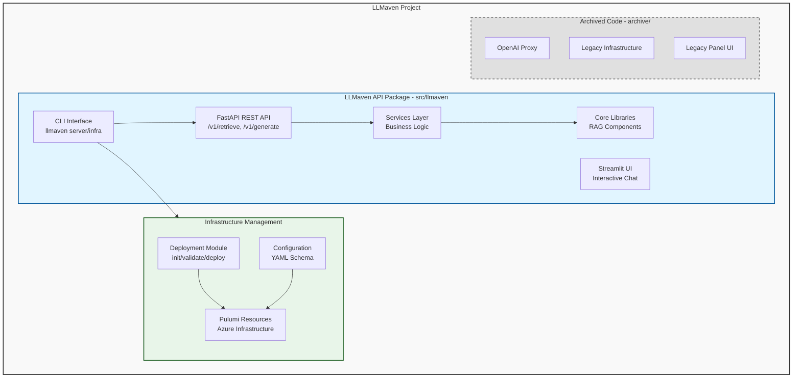

# AGENTS.md - LLMaven AI Assistant Guide

> **Purpose**: This document serves as the definitive technical reference for AI
> assistants working on the LLMaven codebase. It provides comprehensive
> architectural understanding, development patterns, and operational guidance.

---

## Table of Contents

1. [Project Overview](#1-project-overview)
2. [Architecture](#2-architecture)
3. [Directory Structure](#3-directory-structure)
4. [Key Components](#4-key-components)
5. [Technology Stack](#5-technology-stack)
6. [Development Setup](#6-development-setup)
7. [Code Organization](#7-code-organization)
8. [Testing Strategy](#8-testing-strategy)
9. [API/Interfaces](#9-apiinterfaces)
10. [Data Flow](#10-data-flow)
11. [Infrastructure & Deployment](#11-infrastructure--deployment)
12. [Important Files](#12-important-files)
13. [Common Tasks](#13-common-tasks)
14. [Gotchas and Pitfalls](#14-gotchas-and-pitfalls)
15. [Contributing Guidelines](#15-contributing-guidelines)

---

## 1. Project Overview

### Mission Statement

LLMaven is a scientific research tool that democratizes AI-based research by
providing open, transparent, and useful AI software for scientists. The project
leverages Retrieval Augmented Generation (RAG) to extend Large Language Models
(LLMs) with domain-specific knowledge without requiring expensive model training
or fine-tuning.

### Core Goals

1. **Accessibility**: Enable individual researchers without extensive AI/ML
   resources to leverage advanced LLMs
2. **Privacy-Aware**: Use RAG to handle data with privacy/IP concerns
   cost-effectively
3. **Domain Specialization**: Focus on scientific research (initially
   astrophysics and Rubin Observatory/LSST data)
4. **Open Science**: Leverage publicly available datasets and academic knowledge
   bases
5. **Production-Ready Deployment**: Provide enterprise-grade Azure
   infrastructure deployment capabilities

### Project Status

- **Primary Use Case**: Interactive RAG chat application for scientific research
  queries
- **Current Focus**: Astrophysics research (Rubin Observatory documentation,
  arXiv papers)
- **Deployment Options**: Local development, Docker Compose, Azure Cloud
  infrastructure
- **Architecture**: Modern Python package with FastAPI backend, Streamlit
  frontend, and comprehensive infrastructure management

---

## 2. Architecture

### High-Level Architecture

LLMaven is structured as a modern Python package with multiple deployment tiers:



### Current Architecture Components

1. **LLMaven API Package** (`src/llmaven/`): Modern installable package with:

   - FastAPI REST API with versioned endpoints
   - Streamlit interactive frontend
   - CLI for server and infrastructure management
   - RAG core components (retriever, generator, embeddings)
   - Azure infrastructure deployment system

2. **Infrastructure Management**: Production-ready deployment system:

   - YAML-based configuration schema
   - Pulumi-based Azure resource provisioning
   - Comprehensive validation and secret management
   - Support for MLflow and LiteLLM deployment

3. **Archived Code** (`archive/`): Previously active components:
   - OpenAI Proxy Service: Authentication and logging proxy
   - Legacy Infrastructure: Old Pulumi setup
   - Legacy Panel UI: Original Panel-based chat interface

### Architectural Patterns

#### 1. RAG (Retrieval Augmented Generation) Pipeline

**Pattern**: Two-stage LLM enhancement

- **Stage 1: Retrieval** - Query vector database for relevant documents
- **Stage 2: Generation** - Use retrieved context to generate informed responses

**Why**: Extends LLM knowledge without expensive fine-tuning; handles
domain-specific and recent information

**Implementation**:

```python
# Flow: User Query → Embed Query → Vector Search → Format Context → LLM Generation
retriever = Retriever(model_name=embedding_model)
retriever.create_vector_store(documents)  # or load existing
relevant_docs = retriever.retrieve_docs(query)
context = format_context(relevant_docs)
response = language_model.inference(prompt_with_context)
```

#### 2. Service Layer Architecture

**Pattern**: Separation of concerns with distinct layers

- **Endpoints**: FastAPI route handlers (`v1/endpoints/`)
- **Services**: Business logic layer (`services/`)
- **Core**: Reusable ML/AI components (`core/`)
- **Schemas**: Pydantic data models (`schemas/`)

**Why**: Enables testing, reusability, and clear boundaries between concerns

#### 3. Infrastructure as Code (IaC)

**Pattern**: Declarative infrastructure with validation

- YAML configuration for infrastructure definition
- Pydantic schema validation
- Pulumi for Azure resource provisioning
- Secret management via environment variables and Azure Key Vault

**Why**: Reproducible deployments, version-controlled infrastructure, validation
before deployment

---

## 3. Directory Structure

```
llmaven/
├── src/llmaven/                  # Main LLMaven package (installable)
│   ├── __init__.py              # Package initialization with version
│   ├── main.py                  # FastAPI application entry point
│   ├── cli.py                   # CLI commands (server, infra subcommands)
│   ├── config.py                # Web service configuration
│   │
│   ├── v1/                      # API version 1 endpoints
│   │   ├── router.py            # Main v1 router aggregator
│   │   └── endpoints/           # Individual endpoint modules
│   │       ├── retrieve.py      # Document retrieval endpoint
│   │       └── generate.py      # Text generation endpoint
│   │
│   ├── schemas/                 # Pydantic request/response models
│   │   ├── retrieve.py          # RetrieveRequest/Response schemas
│   │   └── generate.py          # GenerationRequest/Response schemas
│   │
│   ├── services/                # Business logic layer
│   │   ├── retrieval_service.py # Retrieval orchestration
│   │   └── generation_service.py# Generation + model caching
│   │
│   ├── core/                    # Core ML/AI components
│   │   ├── embeddings/
│   │   │   └── embedding_model.py  # HuggingFace embeddings
│   │   ├── retriever/
│   │   │   └── retriever.py     # Qdrant vector DB operations
│   │   └── generator/
│   │       ├── language_model.py   # HuggingFace LLM with quantization
│   │       └── embedding_model.py  # Alternative embedding utilities
│   │
│   ├── frontend/                # Streamlit UI components
│   │   ├── app.py               # Streamlit RAG chatbot interface
│   │   └── config.py            # Frontend-specific configuration
│   │
│   ├── deployment/              # Deployment utilities
│   │   ├── init.py              # Configuration initialization
│   │   ├── validate.py          # Configuration validation
│   │   └── deploy.py            # Deployment orchestration
│   │
│   └── infrastructure/          # Infrastructure as Code
│       ├── main.py              # Pulumi program entry point
│       ├── config/              # Configuration schema and loaders
│       │   ├── schema.py        # Pydantic configuration models
│       │   ├── loader.py        # YAML configuration loading
│       │   └── defaults.py      # Default configuration templates
│       ├── resources/           # Azure resource modules
│       │   ├── container_apps.py    # Container Apps resources
│       │   ├── database.py          # PostgreSQL resources
│       │   ├── storage.py           # Storage Account resources
│       │   ├── key_vault.py         # Key Vault resources
│       │   ├── secrets_manager.py   # Secret management
│       │   └── helpers.py           # Utility functions
│       └── utils/               # Infrastructure utilities
│           └── secrets.py       # Secret handling utilities
│
├── archive/                      # Archived code (unused)
│   ├── proxy/                   # OpenAI API proxy service (archived)
│   ├── infra/                   # Legacy infrastructure (archived)
│   └── legacy/                  # Original implementations (archived)
│
├── tests/                        # Test suite
│   ├── test_retriever.py        # Retrieval API integration tests
│   ├── test_generator.py        # Generation tests
│   └── debug_language_model.py  # Debugging utilities
│
├── eval/                         # Evaluation and data collection
│
├── docker/                       # Docker compose configurations
│
├── .github/                      # GitHub configuration
│   ├── workflows/               # CI/CD workflows
│   ├── dependabot.yml           # Dependency updates
│   └── release.yml              # Release configuration
│
├── .devcontainer/               # Dev container configs
│
├── pyproject.toml               # Python project metadata & dependencies
├── pixi.toml                    # Pixi package manager config
├── pixi.lock                    # Locked dependencies
├── .pre-commit-config.yaml      # Pre-commit hooks
├── .flake8                      # Linting configuration
├── llmaven-config.yaml          # Infrastructure configuration (gitignored)
├── AGENTS.md                    # This file - technical reference
└── README.md                    # User-facing documentation
```

### Directory Purposes

| Directory                               | Purpose                             | When to Modify                           |
| --------------------------------------- | ----------------------------------- | ---------------------------------------- |
| `src/llmaven/`                          | Main installable package            | Core API development, adding features    |
| `src/llmaven/v1/`                       | API version 1 endpoints             | Adding/modifying REST endpoints          |
| `src/llmaven/core/`                     | ML/AI components                    | Changing retrieval/generation algorithms |
| `src/llmaven/services/`                 | Business logic                      | Orchestration and service-level logic    |
| `src/llmaven/schemas/`                  | API contracts                       | Request/response data models             |
| `src/llmaven/frontend/`                 | Streamlit UI                        | User interface changes                   |
| `src/llmaven/deployment/`               | Deployment utilities                | Deployment workflow modifications        |
| `src/llmaven/infrastructure/`           | Infrastructure as Code              | Azure resource definitions               |
| `src/llmaven/infrastructure/config/`    | Infrastructure configuration        | Configuration schema and validation      |
| `src/llmaven/infrastructure/resources/` | Azure resources                     | Resource provisioning logic              |
| `archive/proxy/`                        | OpenAI API proxy (archived)         | **Do not modify** - archived code        |
| `archive/infra/`                        | Cloud infrastructure (archived)     | **Do not modify** - archived code        |
| `archive/legacy/`                       | Original implementations (archived) | **Do not modify** - reference only       |
| `tests/`                                | Test suite                          | Adding tests for new features            |
| `docker/`                               | Container orchestration             | Multi-service deployment setup           |

---

## 4. Key Components

### 4.1 CLI Interface (`src/llmaven/cli.py`)

**Responsibility**: Command-line interface for running LLMaven services

**Command Structure**:

```
llmaven
├── server                    # Server management subcommands
│   ├── serve                # Start FastAPI backend
│   └── ui                   # Launch Streamlit frontend
├── infra                     # Infrastructure management subcommands
│   ├── init                 # Initialize configuration
│   ├── validate             # Validate configuration
│   ├── deploy               # Deploy infrastructure
│   ├── destroy              # Destroy infrastructure
│   ├── status               # Show deployment status
│   ├── refresh              # Refresh Pulumi state
│   └── cancel               # Cancel in-progress operation
└── version                   # Display version
```

**Usage Examples**:

```bash
# Development mode with auto-reload
llmaven server serve --env development --reload

# Production mode with 4 workers
llmaven server serve --env production --workers 4

# Launch UI on custom port
llmaven server ui --port 8080 --no-browser

# Infrastructure management
llmaven infra init --environment dev
llmaven infra validate --config llmaven-config.yaml --strict
llmaven infra deploy --preview
llmaven infra status
```

**Design Decisions**:

- Uses Typer for CLI framework (type-safe, auto-documented)
- Nested subcommands for organization (server vs infra)
- Supports both uvicorn (dev) and gunicorn (prod) deployment modes
- Integrated with package entry point for easy installation

---

### 4.2 FastAPI Application (`src/llmaven/main.py`)

**Responsibility**: Main REST API application with endpoints and middleware

**Key Features**:

- **CORS Middleware**: Configurable cross-origin support
- **Exception Handlers**: Consistent error response format
- **API Documentation**: Auto-generated OpenAPI/Swagger docs
- **Versioned Routes**: v1 API prefix for future compatibility

**Endpoints**:

```python
GET  /              # API information and available routes
GET  /ping          # Health check endpoint
GET  /docs          # Swagger UI documentation
GET  /redoc         # ReDoc documentation
POST /v1/retrieve   # Document retrieval
POST /v1/generate   # Text generation
```

**Configuration**:

- Environment-based via `config.py` (Pydantic Settings)
- Supports `.env` file with `API_` prefix
- CORS, title, description, version all configurable

---

### 4.3 Infrastructure Configuration System

**Responsibility**: YAML-based configuration for Azure infrastructure deployment

**Key Files**:

- `infrastructure/config/schema.py`: Pydantic models for validation
- `infrastructure/config/loader.py`: YAML loading and parsing
- `infrastructure/config/defaults.py`: Default configuration templates
- `llmaven-config.yaml`: User configuration file (gitignored)

**Configuration Structure**:

```yaml
project:
  name: llmaven
  environment: dev
  location: eastus
  enable_passphrase: false

azure:
  subscription_id: "your-subscription-id"
  tenant_id: "your-tenant-id"

networking:
  vnet_address_space: "10.0.0.0/16"
  container_apps_subnet: "10.0.1.0/24"
  postgres_subnet: "10.0.2.0/24"

database:
  admin_login: llmaven_admin
  sku_name: "B_Standard_B1ms"
  storage_size_gb: 32
  databases: [llmaven, mlflow_db, litellm_db]

storage:
  account_tier: Standard
  account_replication: LRS
  containers: [mlflow, llmaven]

mlflow:
  enabled: true
  image: "ghcr.io/mlflow/mlflow:latest"
  port: 5000
  cpu: 0.5
  memory: "1Gi"

litellm:
  enabled: true
  image: "ghcr.io/berriai/litellm:latest"
  port: 4000
  cpu: 0.5
  memory: "1Gi"
```

**Validation Features**:

- Schema validation via Pydantic
- Environment variable substitution
- Secret validation (LLMAVEN*SECRETS*\* environment variables)
- Azure subscription and quota checks
- Cost estimation

---

### 4.4 Pulumi Infrastructure (`src/llmaven/infrastructure/main.py`)

**Responsibility**: Programmatic infrastructure deployment using Pulumi

**Deployed Resources**:

1. **Resource Group**: Container for all resources
2. **Virtual Network**: VNet with subnets for Container Apps and PostgreSQL
3. **Key Vault**: Centralized secret management with RBAC
4. **PostgreSQL Flexible Server**: Managed database with auto-generated admin
   password
5. **Storage Account**: Blob storage with ADLS Gen2 support
6. **Container Apps Environment**: Managed container orchestration
7. **Managed Identities**: User-assigned identities for Key Vault access
8. **Container Apps**: MLflow and LiteLLM deployments
9. **Log Analytics Workspace**: Optional monitoring and logging

**Deployment Flow**:

```python
1. Load configuration from llmaven-config.yaml
2. Create Resource Group
3. Create Virtual Network with subnets
4. Create Key Vault and grant deployer access
5. Initialize Secrets Manager
6. Generate and store PostgreSQL admin password
7. Create PostgreSQL Flexible Server
8. Create databases (llmaven, mlflow_db, litellm_db)
9. Create database connection string secrets
10. Create Storage Account
11. Create blob containers
12. Create storage connection string secret
13. Create Log Analytics Workspace (optional)
14. Create Container Apps Environment
15. Create Managed Identities for services
16. Grant Key Vault access to managed identities
17. Deploy MLflow Container App (optional)
18. Deploy LiteLLM Container App (optional)
19. Export stack outputs (URLs, resource names, etc.)
```

**Secret Management**:

- User-provided secrets from environment variables (LLMAVEN*SECRETS*\*)
- Generated secrets (PostgreSQL passwords)
- All secrets stored in Azure Key Vault
- Container apps access secrets via managed identities

---

### 4.5 Retriever (`src/llmaven/core/retriever/retriever.py`)

**Responsibility**: Manage vector database operations and document retrieval

**Key Methods**:

```python
class Retriever:
    def __init__(model_name: str, qdrant_path: str, collection_name: str)
    def create_vector_store(documents: list, collection_name: str) -> Qdrant
    def get_vector_store(qdrant_path: str, collection_name: str) -> Qdrant
    def retrieve_docs(query: str) -> list[Document]
```

**Design Decisions**:

- Uses Qdrant for vector storage (local file-based or remote)
- Supports MMR (Maximal Marginal Relevance) search to avoid redundancy
- Default: retrieves top 2 documents (`k=2`)
- Temporary collections auto-cleanup on recreate (`temp_collection`)

---

### 4.6 Language Model (`src/llmaven/core/generator/language_model.py`)

**Responsibility**: Load and run HuggingFace language models with quantization

**Key Methods**:

```python
class LanguageModel:
    def __init__(model_name: str, generation_config: dict)
    def load_language_model(quantization: Literal["8bit", "4bit"])
    def load_hg_pipeline() -> HuggingFacePipeline
    def inference(prompt: str) -> str
```

**Design Decisions**:

- Supports 4-bit and 8-bit quantization via BitsAndBytes
- Uses `device_map="auto"` for automatic GPU allocation
- Pipeline caching in `generation_service.py` prevents reloading
- Models cached in `core/generator/../../models/`

---

### 4.7 Deployment Module (`src/llmaven/deployment/`)

**Responsibility**: Orchestrate infrastructure deployment workflow

**Key Functions**:

- `init.py`: Generate configuration file with sensible defaults
- `validate.py`: Comprehensive validation before deployment
- `deploy.py`: Deployment orchestration with Pulumi

**Validation Checks**:

1. Configuration file syntax and schema validation
2. Azure subscription existence and permissions
3. Resource quotas and limits
4. Secret presence via environment variables
5. Naming conflicts and resource availability
6. Cost estimation and warnings

**Deployment Options**:

- `--preview`: Show what will be deployed without making changes
- `--yes`: Auto-approve deployment
- `--env-file`: Load secrets from .env file

---

### 4.8 Streamlit Frontend (`src/llmaven/frontend/app.py`)

**Responsibility**: Interactive web UI for RAG chatbot

**Key Features**:

- **Chat Interface**: Message history with role-based display
- **File Upload**: PDF document processing with PyMuPDF
- **Real-time Retrieval**: Shows retrieved document chunks
- **Streaming Generation**: Displays AI-generated responses
- **Session State**: Maintains conversation history

**Configuration** (`src/llmaven/frontend/config.py`):

```python
class FrontendConfig(BaseSettings):
    api_base_url: str = "http://localhost:8000/v1"
    embedding_model: str = "sentence-transformers/all-MiniLM-L12-v2"
    generation_model: str = "allenai/OLMo-2-1124-7B-Instruct"
    existing_collection: str = "rubin_telescope"
    existing_qdrant_path: str = "data/vector_stores/rubin_qdrant"
    retrieval_k: int = 2
```

---

## 5. Technology Stack

### Core Dependencies

| Category                | Technology          | Version   | Purpose                    |
| ----------------------- | ------------------- | --------- | -------------------------- |
| **Language**            | Python              | 3.12      | Primary language (API)     |
| **Language**            | Python              | 3.11      | Other components           |
| **Package Manager**     | Pixi                | >=0.55.0  | Conda/PyPI unified manager |
| **Web Framework**       | FastAPI             | >=0.115.0 | REST API                   |
| **Web Framework**       | Streamlit           | >=1.40.0  | Interactive UI             |
| **ASGI Server**         | Uvicorn             | >=0.30.0  | Development server         |
| **Production Server**   | Gunicorn            | >=21.0.0  | Production WSGI server     |
| **LLM Framework**       | LangChain           | ~=0.3.26  | RAG orchestration          |
| **Vector DB**           | Qdrant              | >=1.11.2  | Semantic search            |
| **Embeddings**          | HuggingFace         | Latest    | Sentence transformers      |
| **LLM Inference**       | Transformers        | ~=4.53.0  | Model loading              |
| **Quantization**        | BitsAndBytes        | >=0.42.0  | 4-bit/8-bit quantization   |
| **IaC**                 | Pulumi              | >=3.100.0 | Infrastructure deployment  |
| **Cloud SDK**           | pulumi-azure-native | >=3.0.0   | Azure resource provider    |
| **HTTP Client**         | httpx               | >=0.27.0  | Async HTTP                 |
| **CLI Framework**       | Typer               | >=0.9.0   | Command-line interface     |
| **Data Validation**     | Pydantic            | >=2.12.4  | Schema validation          |
| **Settings Management** | pydantic-settings   | >=2.0.0   | Configuration management   |

### Development Tools

| Tool       | Purpose                               |
| ---------- | ------------------------------------- |
| pytest     | Unit testing                          |
| pre-commit | Git hooks (linting, formatting)       |
| flake8     | Python linting (max line length: 120) |
| prettier   | YAML/Markdown formatting              |
| codespell  | Spell checking                        |

---

## 6. Development Setup

### Prerequisites

1. **Pixi Package Manager**:

   ```bash
   curl -fsSL https://pixi.sh/install.sh | bash
   ```

2. **Azure CLI** (for infrastructure deployment):

   ```bash
   # macOS
   brew install azure-cli

   # Linux
   curl -sL https://aka.ms/InstallAzureCLIDeb | sudo bash

   # Login
   az login
   ```

3. **Qdrant Vector Database** (optional, for RAG features):
   - Create via
     [Qdrant Database Creation Notebook](https://github.com/uw-ssec/tutorials/blob/main/Archive/SciPy2024/appendix/qdrant-vector-database-creation.ipynb)

### Installation

```bash
# Clone repository
git clone https://github.com/uw-ssec/llmaven.git
cd llmaven

# Install dependencies
pixi install

# Install pre-commit hooks (optional but recommended)
pixi shell -e llmaven
pre-commit install
```

### Running the Application

#### Option 1: Local Development (FastAPI + Streamlit)

```bash
# Method A: Using pixi environment
pixi shell -e llmaven

# Start the FastAPI backend
llmaven server serve --env development --reload
# Server runs at http://localhost:8000

# In a new terminal, start Streamlit UI
pixi shell -e llmaven
llmaven server ui
# UI opens at http://localhost:8501
```

```bash
# Method B: Direct installation
pip install -e .
llmaven server serve --env development --reload
llmaven server ui
```

#### Option 2: Infrastructure Deployment

```bash
# Initialize configuration
pixi shell -e llmaven
llmaven infra init --environment dev

# Edit configuration
vim llmaven-config.yaml

# Set secrets
export LLMAVEN_SECRETS_LITELLM_MASTER_KEY="$(openssl rand -base64 32)"
export LLMAVEN_SECRETS_AZURE_OPENAI_API_KEY="your-key"
export LLMAVEN_SECRETS_ANTHROPIC_API_KEY="your-key"

# Validate configuration
llmaven infra validate

# Preview deployment
llmaven infra deploy --preview

# Deploy infrastructure
llmaven infra deploy --yes

# Check status
llmaven infra status
```

---

## 7. Code Organization

### Naming Conventions

**Files**:

- Python modules: `snake_case.py`
- Config files: `kebab-case.yml`, `UPPERCASE.md`

**Classes**: `PascalCase`

```python
class LanguageModel:
class Retriever:
class SecretsManager:
```

**Functions/Methods**: `snake_case`

```python
def get_embedding_model(model_name: str):
def perform_retrieval(documents, query):
def create_vector_store(documents, collection_name):
```

**Constants**: `UPPER_SNAKE_CASE`

```python
OPENAI_API_KEY = os.getenv("OPENAI_API_KEY")
EMBEDDING_MODEL = "sentence-transformers/all-MiniLM-L12-v2"
```

### Code Style

**Linting**: Flake8 with 120 character line limit

```ini
# .flake8
[flake8]
max-line-length = 120
```

**Pre-commit Hooks**:

- End-of-file fixer
- Trailing whitespace removal
- YAML validation
- Markdown/YAML formatting (prettier)
- Spell checking (codespell)

---

## 8. Testing Strategy

### Test Structure

```
tests/
├── test_retriever.py      # Retrieval API integration tests
├── test_generator.py      # Generation tests
└── debug_language_model.py # Manual debugging utilities
```

### Running Tests

```bash
# Run all tests
pixi shell -e llmaven
pytest

# Run specific test file
pytest tests/test_retriever.py

# Verbose output
pytest -v

# Run with coverage
pytest --cov=llmaven
```

---

## 9. API/Interfaces

### 9.1 LLMaven API

**Base URL**: `http://localhost:8000`

#### Health Check

```http
GET /
```

**Response**:

```json
{
  "message": "LLMaven API",
  "version": "0.1.0",
  "docs": "/docs",
  "ping": "/ping"
}
```

#### Retrieve Endpoint

```http
POST /v1/retrieve
Content-Type: application/json

{
  "documents": [
    {
      "page_content": "Document text content",
      "metadata": {"source": "file.pdf", "page": 1}
    }
  ],
  "query": "What is FastAPI?",
  "existing_collection": null,
  "existing_qdrant_path": null,
  "embedding_model": "sentence-transformers/all-MiniLM-L12-v2"
}
```

**Response**:

```json
{
  "docs": [
    {
      "page_content": "FastAPI is a modern web framework...",
      "metadata": { "source": "file.pdf", "page": 1 }
    }
  ],
  "status_code": 200
}
```

#### Generate Endpoint

```http
POST /v1/generate
Content-Type: application/json

{
  "prompt": "Answer the following question:\n\nContext: ...\n\nQuestion: What is FastAPI?",
  "generation_model": "allenai/OLMo-2-1124-7B-Instruct"
}
```

**Response**:

```json
{
  "answer": "FastAPI is a modern, fast web framework...",
  "status_code": 200
}
```

---

## 10. Data Flow

### RAG Request Flow

```
┌─────────────────────────────────────────────────────────────────┐
│                    RAG Request Flow                              │
└─────────────────────────────────────────────────────────────────┘

1. User Input
   │
   ├─→ Query: "What is the Rubin Observatory?"
   │
2. Query Expansion (Frontend)
   │
   ├─→ "What is the Rubin Observatory? LSST Large Synoptic..."
   │
3. Retrieval API Call
   │
   ├─→ POST /v1/retrieve
   │   ├─ documents: [] (using existing collection)
   │   ├─ query: "What is the Rubin Observatory?..."
   │   ├─ existing_collection: "arxiv_astro-ph_abstracts"
   │   ├─ existing_qdrant_path: "~/.cache/ssec_tutorials/scipy_qdrant"
   │   └─ embedding_model: "sentence-transformers/all-MiniLM-L12-v2"
   │
4. Retrieval Service
   │
   ├─→ Instantiate Retriever
   ├─→ Load Vector Store (Qdrant)
   ├─→ Embed Query (HuggingFace)
   ├─→ Search Vector DB (MMR, k=2)
   └─→ Return Top 2 Documents
   │
5. Format Context + Prompt
   │
   ├─→ Combine retrieved docs
   ├─→ Insert into prompt template
   └─→ "You are an astrophysics expert...\n\nContext: [docs]\n\nQuestion: ..."
   │
6. Generation API Call
   │
   ├─→ POST /v1/generate
   │   ├─ prompt: "[full prompt with context]"
   │   └─ generation_model: "allenai/OLMo-2-1124-7B-Instruct"
   │
7. Generation Service
   │
   ├─→ Check Model Cache
   ├─→ (If not cached) Load Model + Quantize (8-bit)
   ├─→ Run Inference
   └─→ Return Generated Text
   │
8. Display to User
   │
   └─→ Show: Generated Answer + Retrieved Documents
```

---

## 11. Infrastructure & Deployment

### Configuration Management

**Configuration File**: `llmaven-config.yaml` (gitignored)

**Key Sections**:

1. **Project**: Name, environment, location
2. **Azure**: Subscription ID, tenant ID
3. **Networking**: VNet and subnet configuration
4. **Database**: PostgreSQL configuration
5. **Storage**: Storage account configuration
6. **Monitoring**: Log Analytics settings
7. **MLflow**: MLflow deployment configuration
8. **LiteLLM**: LiteLLM deployment configuration

**Secret Management**:

Secrets are provided via environment variables with the `LLMAVEN_SECRETS_`
prefix:

```bash
export LLMAVEN_SECRETS_LITELLM_MASTER_KEY="your-master-key"
export LLMAVEN_SECRETS_AZURE_OPENAI_API_KEY="your-azure-openai-key"
export LLMAVEN_SECRETS_ANTHROPIC_API_KEY="your-anthropic-key"
# ... more secrets as needed
```

Or using a .env file:

```bash
llmaven infra validate --env-file .env.secrets
llmaven infra deploy --env-file .env.secrets
```

### Deployment Workflow

```bash
# 1. Initialize configuration
llmaven infra init --environment dev

# 2. Edit configuration
vim llmaven-config.yaml

# 3. Set secrets (choose one method)
# Method A: Export environment variables
export LLMAVEN_SECRETS_LITELLM_MASTER_KEY="$(openssl rand -base64 32)"

# Method B: Create .env file
echo 'LLMAVEN_SECRETS_LITELLM_MASTER_KEY="your-key"' > .env.secrets

# 4. Validate configuration
llmaven infra validate --config llmaven-config.yaml --strict

# 5. Preview deployment
llmaven infra deploy --preview

# 6. Deploy infrastructure
llmaven infra deploy --yes

# 7. Check status
llmaven infra status

# 8. Refresh state (if needed)
llmaven infra refresh

# 9. Destroy (when done)
llmaven infra destroy --yes
```

### Azure Resources Created

1. **Resource Group**: `rg-llmaven-{environment}`
2. **Virtual Network**: `vnet-llmaven-{environment}`
   - Container Apps Subnet: `10.0.1.0/24`
   - PostgreSQL Subnet: `10.0.2.0/24`
3. **Key Vault**: For secret storage with RBAC
4. **PostgreSQL Flexible Server**: With auto-generated admin password
   - Databases: `llmaven`, `mlflow_db`, `litellm_db`
5. **Storage Account**: With ADLS Gen2 support
   - Containers: `mlflow`, `llmaven`
6. **Container Apps Environment**: For container orchestration
7. **Managed Identities**: For MLflow and LiteLLM
8. **Container Apps**:
   - MLflow: Experiment tracking and model registry
   - LiteLLM: OpenAI-compatible API gateway
9. **Log Analytics Workspace**: (optional) For monitoring

### Cost Considerations

**Development Environment (default)**:

- PostgreSQL: B_Standard_B1ms (~$12/month)
- Storage: Standard LRS (~$3/month for 100GB)
- Container Apps: Consumption plan (~$5/month for light usage)
- **Total: ~$20-30/month**

**Production Environment**:

- PostgreSQL: GP_Standard_D2s_v3 (~$200/month)
- Storage: Standard GRS (~$10/month for 100GB)
- Container Apps: Dedicated plan (~$50-100/month)
- High Availability: +100%
- **Total: ~$400-600/month**

---

## 12. Important Files

### Configuration Files

| File                             | Purpose                 | Critical Fields                                              |
| -------------------------------- | ----------------------- | ------------------------------------------------------------ |
| `pyproject.toml`                 | Python package metadata | `dependencies`, `scripts` (llmaven CLI), `version`           |
| `pixi.toml`                      | Package manager config  | `dependencies`, `pypi-dependencies`, `environments`, `tasks` |
| `src/llmaven/config.py`          | API configuration       | `api_title`, `api_version`, `cors_origins`                   |
| `src/llmaven/frontend/config.py` | Frontend configuration  | `api_base_url`, `embedding_model`, `generation_model`        |
| `llmaven-config.yaml`            | Infrastructure config   | All Azure resource definitions                               |
| `.flake8`                        | Linting rules           | `max-line-length = 120`                                      |
| `.pre-commit-config.yaml`        | Git hooks               | Code quality checks                                          |

### Entry Points

| File                                | Command                    | Purpose                         |
| ----------------------------------- | -------------------------- | ------------------------------- |
| `src/llmaven/cli.py`                | `llmaven server serve`     | FastAPI API server (CLI)        |
| `src/llmaven/cli.py`                | `llmaven server ui`        | Streamlit frontend (CLI)        |
| `src/llmaven/cli.py`                | `llmaven infra init`       | Initialize deployment config    |
| `src/llmaven/cli.py`                | `llmaven infra deploy`     | Deploy infrastructure           |
| `src/llmaven/main.py`               | `uvicorn llmaven.main:app` | FastAPI app (direct)            |
| `src/llmaven/frontend/app.py`       | `streamlit run app.py`     | Streamlit UI (direct)           |
| `archive/legacy/rubin-panel-app.py` | `pixi run serve-panel`     | Legacy Panel chat UI (archived) |

---

## 13. Common Tasks

### 13.1 Add a New API Endpoint

**Scenario**: Add a `/v1/summarize/` endpoint

**Steps**:

1. **Create Schema** (`src/llmaven/schemas/summarize.py`):

```python
from pydantic import BaseModel

class SummarizeRequest(BaseModel):
    text: str
    max_length: int = 100

class SummarizeResponse(BaseModel):
    summary: str
    status_code: int
```

2. **Create Service** (`src/llmaven/services/summarize_service.py`):

```python
from llmaven.core.generator.language_model import LanguageModel

def summarize_text(text: str, max_length: int) -> dict:
    prompt = f"Summarize the following text in {max_length} words:\n\n{text}"
    model = LanguageModel(model_name="facebook/bart-large-cnn")
    response = model.inference(prompt)
    return {"summary": response, "status_code": 200}
```

3. **Create Endpoint** (`src/llmaven/v1/endpoints/summarize.py`):

```python
from fastapi import APIRouter, HTTPException
from llmaven.schemas.summarize import SummarizeRequest, SummarizeResponse
from llmaven.services.summarize_service import summarize_text

router = APIRouter()

@router.post("/summarize/", response_model=SummarizeResponse)
async def summarize(request: SummarizeRequest):
    try:
        result = summarize_text(request.text, request.max_length)
        return result
    except Exception as e:
        raise HTTPException(status_code=500, detail=str(e))
```

4. **Register Router** (`src/llmaven/v1/router.py`):

```python
from llmaven.v1.endpoints import summarize

router.include_router(summarize.router)
```

5. **Add Tests** (`tests/test_summarize.py`):

```python
from fastapi.testclient import TestClient
from llmaven.main import app

client = TestClient(app)

def test_summarize_endpoint():
    payload = {"text": "Long text...", "max_length": 50}
    response = client.post("/v1/summarize/", json=payload)
    assert response.status_code == 200
    assert "summary" in response.json()
```

---

### 13.2 Deploy to Azure

**Scenario**: Deploy LLMaven infrastructure to Azure

**Steps**:

1. **Login to Azure**:

```bash
az login
az account set --subscription "your-subscription-id"
```

2. **Initialize Configuration**:

```bash
pixi shell -e llmaven
llmaven infra init --environment dev
```

3. **Edit Configuration** (`llmaven-config.yaml`):

```yaml
project:
  name: llmaven
  environment: dev
  location: eastus

azure:
  subscription_id: "your-subscription-id"
  # tenant_id will be auto-detected
# Customize other settings as needed
```

4. **Set Secrets**:

```bash
# Generate a secure master key
export LLMAVEN_SECRETS_LITELLM_MASTER_KEY="$(openssl rand -base64 32)"

# Add your API keys
export LLMAVEN_SECRETS_AZURE_OPENAI_API_KEY="your-azure-openai-key"
export LLMAVEN_SECRETS_ANTHROPIC_API_KEY="your-anthropic-key"
```

5. **Validate Configuration**:

```bash
llmaven infra validate --strict
```

6. **Preview Deployment**:

```bash
llmaven infra deploy --preview
```

7. **Deploy Infrastructure**:

```bash
llmaven infra deploy --yes
```

8. **Check Status**:

```bash
llmaven infra status
```

9. **Access Deployed Services**:

- MLflow: https://llmaven-dev-mlflow.{region}.azurecontainerapps.io
- LiteLLM: https://llmaven-dev-litellm.{region}.azurecontainerapps.io

---

## 14. Gotchas and Pitfalls

### 14.1 Vector Database Issues

**Problem**: `Collection not found` error

**Cause**: Qdrant path or collection name incorrect

**Solution**:

```python
from qdrant_client import QdrantClient
client = QdrantClient(path="~/.cache/ssec_tutorials/scipy_qdrant")
collections = client.get_collections()
print([c.name for c in collections.collections])
```

---

### 14.2 Infrastructure Deployment Issues

**Problem**: Deployment fails with "subscription not found"

**Cause**: Not logged into Azure CLI or wrong subscription

**Solution**:

```bash
az login
az account list --output table
az account set --subscription "your-subscription-id"
```

---

**Problem**: Validation fails with "secrets not found"

**Cause**: Environment variables not set

**Solution**:

```bash
# Check current environment variables
env | grep LLMAVEN_SECRETS_

# Set required secrets
export LLMAVEN_SECRETS_LITELLM_MASTER_KEY="$(openssl rand -base64 32)"
export LLMAVEN_SECRETS_AZURE_OPENAI_API_KEY="your-key"

# Or use .env file
llmaven infra validate --env-file .env.secrets
```

---

### 14.3 Model Loading Issues

**Problem**: `CUDA out of memory` error

**Cause**: Model too large for GPU

**Solutions**:

1. Use 4-bit quantization:
   ```python
   model.load_language_model(quantization="4bit")
   ```
2. Use CPU inference (slower):
   ```python
   model = AutoModelForCausalLM.from_pretrained(
       model_name,
       device_map="cpu"
   )
   ```

---

## 15. Contributing Guidelines

### 15.1 Git Workflow

1. **Create Feature Branch**:

```bash
git checkout -b feature/add-infrastructure-monitoring
```

2. **Make Changes** (follow code style)

3. **Run Pre-commit Hooks**:

```bash
pre-commit run --all-files
```

4. **Commit** (use conventional commits):

```bash
git add .
git commit -m "feat(infra): add monitoring dashboards to deployment"
```

5. **Push and Create PR**:

```bash
git push origin feature/add-infrastructure-monitoring
```

### 15.2 Commit Message Format

Follow [Conventional Commits](https://www.conventionalcommits.org/):

```
<type>(<scope>): <subject>

<body>

<footer>
```

**Types**:

- `feat`: New feature
- `fix`: Bug fix
- `docs`: Documentation changes
- `style`: Code style (formatting, no logic change)
- `refactor`: Code refactoring
- `test`: Add or update tests
- `chore`: Maintenance tasks (deps, configs)
- `perf`: Performance improvements

**Scopes**:

- `api`: FastAPI backend
- `ui`: Streamlit frontend
- `infra`: Infrastructure deployment
- `core`: Core RAG components
- `cli`: Command-line interface

---

## Appendix A: Glossary

| Term             | Definition                                                                          |
| ---------------- | ----------------------------------------------------------------------------------- |
| **RAG**          | Retrieval Augmented Generation - LLM technique combining retrieval and generation   |
| **Qdrant**       | Open-source vector database for semantic search                                     |
| **MMR**          | Maximal Marginal Relevance - search algorithm that balances relevance and diversity |
| **Embedding**    | Numerical vector representation of text for semantic similarity                     |
| **Quantization** | Reducing model precision (32-bit → 8-bit/4-bit) to save memory                      |
| **Pixi**         | Modern package manager for Conda and PyPI                                           |
| **Pulumi**       | Infrastructure as Code tool for cloud deployments                                   |
| **HuggingFace**  | Platform for sharing ML models and datasets                                         |
| **OLMo**         | Open Language Model by Allen Institute for AI                                       |
| **LSST**         | Large Synoptic Survey Telescope (now Rubin Observatory)                             |

---

## Appendix B: Quick Reference Commands

```bash
# Installation
pixi install                          # Install all dependencies
pixi shell -e llmaven                 # Enter llmaven environment

# Development - API
llmaven server serve --env development --reload  # Start API with auto-reload
llmaven server ui                     # Start Streamlit UI
llmaven version                       # Show version

# Infrastructure
llmaven infra init                    # Initialize configuration
llmaven infra validate --strict       # Validate configuration
llmaven infra deploy --preview        # Preview deployment
llmaven infra deploy --yes            # Deploy infrastructure
llmaven infra status                  # Check deployment status
llmaven infra destroy --yes           # Destroy infrastructure

# Testing
pytest                                # Run all tests
pytest tests/test_retriever.py -v    # Run specific test
pytest --cov=llmaven                  # Run with coverage

# Linting
pre-commit run --all-files            # Run all pre-commit hooks
flake8 src/llmaven/                   # Lint Python code

# Git
git checkout -b feature/my-feature    # Create feature branch
pre-commit run                        # Run hooks before commit
git commit -m "feat: add feature"     # Commit with conventional format
```

---

**Document Version**: 2.0 **Last Updated**: 2025-12-04 **Maintained By**:
LLMaven Development Team (UW SSEC)
