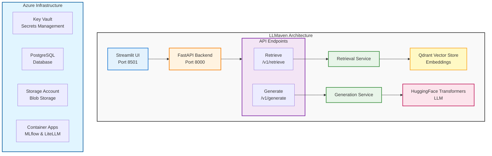

# LLMaven

An AI-powered tool library for scientific research using Retrieval Augmented
Generation (RAG) with Large Language Models (LLMs). LLMaven provides open,
transparent, and useful AI-based software for scientific discovery by leveraging
publicly available diverse datasets and disparate academic knowledge bases.

## Overview

LLMaven's scientific goal is to create accessible AI tools for researchers who
need to work with private/IP-sensitive data in a cost-effective manner. The
project uses RAG-based LLMs to extend language models with domain-specific
knowledge without requiring expensive model training or specialized hardware for
individual researchers.

### Key Features

- **FastAPI Backend**: RESTful API with retrieval and generation endpoints
- **Streamlit Frontend**: Interactive chat interface for document Q&A
- **RAG Architecture**: Combines retrieval from vector databases with language
  model generation
- **Vector Database**: Qdrant-based document storage with semantic search (MMR -
  Maximal Marginal Relevance)
- **Agentic RAG System** (NEW): Next-generation hybrid search with multi-vector
  embeddings (Dense + Sparse + ColBERT) and intelligent agent-based Q&A
- **Flexible Models**:
  - Embedding models via HuggingFace (default:
    sentence-transformers/all-MiniLM-L12-v2)
  - Generation models via HuggingFace Transformers (default:
    allenai/OLMo-2-1124-7B-Instruct)
  - Quantization support (4-bit/8-bit) for efficient inference
- **Infrastructure Deployment**: Production-ready Azure infrastructure
  deployment with Pulumi
  - PostgreSQL Flexible Server for persistent storage
  - Azure Key Vault for secret management
  - Container Apps for MLflow and LiteLLM
  - Comprehensive validation and cost estimation

## Architecture

LLMaven consists of several components that work together:



### Core Components

1. **FastAPI Backend** (`/src/llmaven/main.py`)
   - RESTful API with automatic OpenAPI documentation
   - CORS middleware for frontend integration
   - Error handling and validation
   - Health check endpoints

2. **Streamlit Frontend** (`/src/llmaven/frontend/app.py`)
   - Interactive chat interface
   - Document upload (PDF support)
   - Real-time retrieval and generation
   - Chat history display

3. **Retrieval Service** (`/src/llmaven/services/retrieval_service.py`)
   - Document embedding and vector storage
   - Semantic search using Qdrant
   - MMR (Maximal Marginal Relevance) retrieval
   - Support for temporary and persistent collections

4. **Generation Service** (`/src/llmaven/services/generation_service.py`)
   - Language model inference with caching
   - Quantized model loading (4-bit/8-bit)
   - HuggingFace Pipeline integration
   - Configurable generation parameters

5. **Infrastructure Management** (`/src/llmaven/infrastructure/`)
   - YAML-based configuration schema
   - Pulumi-based Azure resource provisioning
   - Secret management via Azure Key Vault
   - Comprehensive validation and deployment workflow

## Installation

### Prerequisites

- Python 3.12+ (for LLMaven API)
- Python 3.11+ (for other components)
- [Pixi](https://pixi.sh) package manager
- Azure CLI (for infrastructure deployment)

### Quick Start

1. **Install Pixi**:

   ```bash
   curl -fsSL https://pixi.sh/install.sh | bash
   ```

2. **Clone the repository**:

   ```bash
   git clone https://github.com/uw-ssec/llmaven.git
   cd llmaven
   ```

3. **Install dependencies**:
   ```bash
   pixi install
   ```

### Environment Setup

LLMaven uses multiple Pixi environments for different components:

- `llmaven`: Main API environment (Python 3.12)
- `frontend`: Streamlit UI environment
- `proxy`: OpenAI proxy service environment (archived)
- `infra`: Infrastructure management environment

## Usage

### Option 1: Agentic RAG (Recommended for New Projects)

The agentic RAG system provides superior retrieval accuracy with hybrid search
and intelligent agent-based Q&A.

#### Quick Start

1. **Start Qdrant** (required for vector storage):

```bash
docker run -p 6333:6333 qdrant/qdrant
```

2. **Ingest Documents**:

```bash
# Enter the llmaven environment
pixi shell -e llmaven

# Ingest documents from a directory
llmaven agentic ingest ./docs

# Or ingest from multiple directories
llmaven agentic ingest ./docs ./papers --collection research-docs
```

3. **Search the Knowledge Base**:

```bash
# Hybrid search with reranking
llmaven agentic search "What is machine learning?"

# Search without reranking (faster)
llmaven agentic search "vector embeddings" --no-rerank

# Custom top-k results
llmaven agentic search "transformer architecture" --top-k 10
```

4. **Interactive Chat**:

```bash
# Start interactive RAG chat
llmaven agentic chat

# Use custom collection or LLM provider
llmaven agentic chat --collection my-docs --provider ollama --model llama2
```

#### Configuration

Set environment variables with `AGENTIC_` prefix:

```bash
# Qdrant configuration
export AGENTIC_QDRANT_URL=http://localhost:6333
export AGENTIC_COLLECTION_NAME=agentic-rag

# LLM configuration
export AGENTIC_LLM_PROVIDER=openai
export AGENTIC_LLM_MODEL=gpt-4o-mini

# Search configuration
export AGENTIC_ENABLE_RERANK=true
export AGENTIC_PREFETCH_TOP_K=20
export AGENTIC_FINAL_TOP_K=5
```

See [AGENTS.md](AGENTS.md) for complete configuration options and architecture
details.

### Option 2: Local Development (API and UI)

The primary way to use LLMaven is through its FastAPI backend and Streamlit
frontend.

#### 1. Start the API Server

```bash
# Using the pixi environment (recommended)
pixi shell -e llmaven

# Start in development mode with auto-reload
llmaven server serve --env development --reload

# Or start in production mode with multiple workers
llmaven server serve --env production --workers 4
```

The API will be available at:

- API: http://localhost:8000
- API Documentation: http://localhost:8000/docs
- Alternative Docs: http://localhost:8000/redoc

#### 2. Start the Streamlit UI

In a separate terminal:

```bash
# Using the pixi environment (recommended)
pixi shell -e llmaven

# Launch the UI
llmaven server ui

# Or customize host and port
llmaven server ui --host 0.0.0.0 --port 8080 --no-browser
```

The UI will open automatically in your browser at http://localhost:8501

#### 3. Using the UI

1. **Upload Documents**: Use the file uploader to add PDF documents
2. **Ask Questions**: Type your question in the chat input
3. **View Results**: See retrieved document chunks and AI-generated answers
4. **Chat History**: All interactions are stored in the session

### Option 3: Azure Infrastructure Deployment

LLMaven provides a comprehensive infrastructure deployment system for production
workloads.

#### 1. Initialize Configuration

```bash
# Enter the llmaven environment
pixi shell -e llmaven

# Initialize deployment configuration
llmaven infra init --environment dev

# This creates llmaven-config.yaml with sensible defaults
```

#### 2. Configure Infrastructure

Edit the generated `llmaven-config.yaml` file:

```yaml
project:
  name: llmaven
  environment: dev
  location: eastus

azure:
  subscription_id: "your-subscription-id"
  # tenant_id is auto-detected

database:
  admin_login: llmaven_admin
  sku_name: "B_Standard_B1ms"
  databases: [llmaven, mlflow_db, litellm_db]

mlflow:
  enabled: true
  image: "ghcr.io/mlflow/mlflow:latest"

litellm:
  enabled: true
  image: "ghcr.io/berriai/litellm:latest"
```

#### 3. Set Secrets

Secrets are provided via environment variables:

```bash
# Generate a secure master key
export LLMAVEN_SECRETS_LITELLM_MASTER_KEY="$(openssl rand -base64 32)"

# Add your API keys
export LLMAVEN_SECRETS_AZURE_OPENAI_API_KEY="your-azure-openai-key"
export LLMAVEN_SECRETS_ANTHROPIC_API_KEY="your-anthropic-key"

# Or create a .env file
cat > .env.secrets <<EOF
LLMAVEN_SECRETS_LITELLM_MASTER_KEY=your-master-key
LLMAVEN_SECRETS_AZURE_OPENAI_API_KEY=your-azure-openai-key
LLMAVEN_SECRETS_ANTHROPIC_API_KEY=your-anthropic-key
EOF
```

#### 4. Validate Configuration

```bash
# Validate with strict mode (recommended for production)
llmaven infra validate --config llmaven-config.yaml --strict

# Or validate with secrets from .env file
llmaven infra validate --env-file .env.secrets --strict
```

This validates:

- Configuration syntax and schema
- Azure subscription and permissions
- Resource quotas and limits
- Secret presence
- Cost estimation

#### 5. Deploy Infrastructure

```bash
# Preview what will be deployed
llmaven infra deploy --preview

# Deploy infrastructure
llmaven infra deploy --yes

# Or deploy with .env file
llmaven infra deploy --env-file .env.secrets --yes
```

#### 6. Check Deployment Status

```bash
# View deployment status and resource URLs
llmaven infra status

# Outputs include:
# - MLflow URL: https://llmaven-dev-mlflow.{region}.azurecontainerapps.io
# - LiteLLM URL: https://llmaven-dev-litellm.{region}.azurecontainerapps.io
# - Resource names (Key Vault, Storage Account, PostgreSQL, etc.)
```

#### 7. Destroy Infrastructure (when done)

```bash
# Destroy all resources
llmaven infra destroy --yes
```

### Deployed Azure Resources

When you deploy infrastructure, LLMaven creates:

1. **Resource Group**: Container for all resources
2. **Virtual Network**: With subnets for Container Apps and PostgreSQL
3. **Key Vault**: Centralized secret management with RBAC
4. **PostgreSQL Flexible Server**: Managed database with:
   - Databases: llmaven, mlflow_db, litellm_db
   - Auto-generated admin password stored in Key Vault
5. **Storage Account**: With ADLS Gen2 support
   - Containers: mlflow, llmaven
6. **Container Apps Environment**: For container orchestration
7. **Managed Identities**: For secure Key Vault access
8. **Container Apps** (optional):
   - **MLflow**: Experiment tracking and model registry
   - **LiteLLM**: OpenAI-compatible API gateway
9. **Log Analytics Workspace**: (optional) For monitoring

### Cost Estimation

**Development Environment** (~$20-30/month):

- PostgreSQL: B_Standard_B1ms
- Storage: Standard LRS
- Container Apps: Consumption plan

**Production Environment** (~$400-600/month):

- PostgreSQL: GP_Standard_D2s_v3
- Storage: Standard GRS
- Container Apps: Dedicated plan
- High Availability enabled

## API Endpoints

### Agentic RAG Endpoints (NEW)

**POST** `/v1/agentic/retrieve`

Hybrid search with multi-vector retrieval (Dense, Sparse, ColBERT).

```bash
curl -X POST http://localhost:8000/v1/agentic/retrieve \
  -H "Content-Type: application/json" \
  -d '{
    "query": "What is machine learning?",
    "collection": "agentic-rag",
    "top_k": 5,
    "enable_rerank": true
  }'
```

**POST** `/v1/agentic/chat`

RAG chat with structured responses and citations.

```bash
curl -X POST http://localhost:8000/v1/agentic/chat \
  -H "Content-Type: application/json" \
  -d '{
    "query": "Explain transformers",
    "collection": "agentic-rag",
    "message_history": []
  }'
```

### Legacy Endpoints

**POST** `/v1/retrieve`

Retrieve relevant documents based on a query.

```bash
curl -X POST http://localhost:8000/v1/retrieve \
  -H "Content-Type: application/json" \
  -d '{
    "query": "What is the Rubin telescope?",
    "embedding_model": "sentence-transformers/all-MiniLM-L12-v2",
    "existing_collection": "rubin_telescope",
    "existing_qdrant_path": "data/vector_stores/rubin_qdrant"
  }'
```

**Request Schema:**

```json
{
  "documents": [],
  "query": "string",
  "existing_collection": "string",
  "existing_qdrant_path": "string",
  "embedding_model": "string"
}
```

**Response:**

```json
{
  "docs": [
    {
      "page_content": "Document text...",
      "metadata": {}
    }
  ],
  "status_code": 200
}
```

### Generation Endpoint

**POST** `/v1/generate`

Generate text based on a prompt.

```bash
curl -X POST http://localhost:8000/v1/generate \
  -H "Content-Type: application/json" \
  -d '{
    "prompt": "Based on the context: ... Answer the question: ...",
    "generation_model": "allenai/OLMo-2-1124-7B-Instruct"
  }'
```

**Request Schema:**

```json
{
  "prompt": "string",
  "generation_model": "string"
}
```

**Response:**

```json
{
  "answer": "Generated text...",
  "status_code": 200
}
```

## Configuration

### Environment Variables

Create a `.env` file in the root directory:

```bash
# API Configuration
API_TITLE="LLMaven API"
API_VERSION="0.1.0"
API_CORS_ORIGINS=["*"]

# Frontend Configuration
FRONTEND_API_BASE_URL="http://localhost:8000/v1"
FRONTEND_EMBEDDING_MODEL="sentence-transformers/all-MiniLM-L12-v2"
FRONTEND_GENERATION_MODEL="allenai/OLMo-2-1124-7B-Instruct"
FRONTEND_EXISTING_COLLECTION="rubin_telescope"
FRONTEND_EXISTING_QDRANT_PATH="data/vector_stores/rubin_qdrant"
FRONTEND_RETRIEVAL_K=2

# Model Configuration
EMBEDDING_MODEL_NAME="intfloat/multilingual-e5-large-instruct"
```

### Model Configuration

#### Embedding Models

LLMaven supports any HuggingFace sentence-transformers model:

- `sentence-transformers/all-MiniLM-L12-v2` (default, lightweight)
- `intfloat/multilingual-e5-large-instruct` (multilingual)
- `sentence-transformers/all-mpnet-base-v2` (higher quality)

#### Generation Models

Supports HuggingFace Transformers models:

- `allenai/OLMo-2-1124-7B-Instruct` (default, 7B parameters)
- Any causal LM from HuggingFace

**Quantization Options:**

- 8-bit: Good balance of quality and memory
- 4-bit: Lower memory, slightly reduced quality

Models are cached locally in `src/llmaven/models/` directory.

## Project Structure

```
llmaven/
├── src/llmaven/              # Main application package
│   ├── __init__.py
│   ├── cli.py                # Command-line interface
│   ├── config.py             # API configuration
│   ├── main.py               # FastAPI application
│   ├── core/                 # Core RAG components (legacy)
│   │   ├── embeddings/       # Embedding model wrapper
│   │   ├── generator/        # Language model wrapper
│   │   └── retriever/        # Vector retrieval logic
│   ├── agentic/              # Agentic RAG system (NEW)
│   │   ├── agent/            # RAG agent with pydantic-ai
│   │   ├── ingestion/        # Document ingestion pipeline
│   │   ├── search/           # Hybrid search implementation
│   │   ├── vector_store/     # Qdrant manager with Named Vectors
│   │   └── settings.py       # Configuration management
│   ├── frontend/             # Streamlit UI
│   │   ├── app.py            # Main UI application
│   │   └── config.py         # Frontend configuration
│   ├── schemas/              # Pydantic models
│   │   ├── retrieve.py       # Retrieval request/response
│   │   └── generate.py       # Generation request/response
│   ├── services/             # Business logic
│   │   ├── retrieval_service.py
│   │   └── generation_service.py
│   ├── v1/                   # API v1 endpoints
│   │   ├── router.py         # Main router
│   │   └── endpoints/        # Endpoint implementations
│   │       ├── retrieve.py
│   │       └── generate.py
│   ├── deployment/           # Deployment utilities
│   │   ├── init.py           # Configuration initialization
│   │   ├── validate.py       # Configuration validation
│   │   └── deploy.py         # Deployment orchestration
│   └── infrastructure/       # Infrastructure as Code
│       ├── main.py           # Pulumi program entry point
│       ├── config/           # Configuration schema and loaders
│       ├── resources/        # Azure resource modules
│       └── utils/            # Infrastructure utilities
├── archive/                  # Archived code (unused)
│   ├── proxy/                # OpenAI API proxy service (archived)
│   ├── infra/                # Infrastructure as code (archived)
│   └── legacy/               # Legacy Panel application (archived)
├── tests/                    # Test suite
│   ├── test_retriever.py
│   └── test_generator.py
├── pixi.toml                 # Pixi configuration
├── pyproject.toml            # Python package configuration
└── README.md                 # This file
```

## Development

### Running Tests

```bash
# Run all tests
pixi shell -e llmaven
pytest

# Run specific test file
pytest tests/test_retriever.py

# Run with verbose output
pytest -v

# Run with coverage
pytest --cov=llmaven
```

### Code Quality

The project uses pre-commit hooks for code quality:

```bash
# Install pre-commit hooks
pixi shell -e llmaven
pre-commit install

# Run manually
pre-commit run --all-files
```

Configured linters:

- flake8 (Python linting)
- prettier (YAML/Markdown formatting)
- codespell (spell checking)

### Development Mode

Run the API server with auto-reload for development:

```bash
llmaven server serve --env development --reload
```

Changes to Python files will automatically restart the server.

## CLI Reference

LLMaven provides a comprehensive command-line interface:

### Agentic RAG Commands

```bash
# Ingest documents
llmaven agentic ingest [DIRECTORIES]... [OPTIONS]

Options:
  --collection, -c TEXT    Collection name (defaults to config)
  --force, -f              Overwrite existing collection
  --batch-size, -b INT     Documents per batch (default: 100)

# Search knowledge base
llmaven agentic search <QUERY> [OPTIONS]

Options:
  --collection, -c TEXT    Collection name (defaults to config)
  --top-k, -k INT          Number of results (default: 5)
  --prefetch-k, -p INT     Prefetch candidates per method (default: 20)
  --rerank/--no-rerank     Enable/disable ColBERT reranking

# Interactive chat
llmaven agentic chat [OPTIONS]

Options:
  --collection, -c TEXT    Collection name (defaults to config)
  --provider TEXT          LLM provider (openai, ollama, huggingface)
  --model, -m TEXT         LLM model identifier
```

### Server Commands

```bash
# Start API server
llmaven server serve [OPTIONS]

Options:
  --host TEXT         Host to bind (default: 0.0.0.0)
  --port INTEGER      Port to bind (default: 8000)
  --env TEXT          Environment: development|production
  --workers INTEGER   Number of workers (production only)
  --reload            Enable auto-reload (development only)

# Start Streamlit UI
llmaven server ui [OPTIONS]

Options:
  --host TEXT         Host to bind (default: localhost)
  --port INTEGER      Port to bind (default: 8501)
  --browser/--no-browser  Open browser automatically
```

### Infrastructure Commands

```bash
# Initialize configuration
llmaven infra init [OPTIONS]

Options:
  --environment TEXT  Environment (dev, staging, prod)
  --output TEXT       Output path for configuration file
  --interactive       Interactive mode with prompts

# Validate configuration
llmaven infra validate [OPTIONS]

Options:
  --config TEXT       Path to configuration file
  --strict            Fail on warnings
  --skip-secrets      Skip secrets validation
  --env-file TEXT     Path to .env file with secrets

# Deploy infrastructure
llmaven infra deploy [OPTIONS]

Options:
  --config TEXT       Path to configuration file
  --preview           Preview changes without deploying
  --yes               Automatically approve deployment
  --env-file TEXT     Path to .env file with secrets

# Show deployment status
llmaven infra status [OPTIONS]

# Destroy infrastructure
llmaven infra destroy [OPTIONS]

# Refresh Pulumi state
llmaven infra refresh [OPTIONS]

# Cancel in-progress operation
llmaven infra cancel [OPTIONS]

# Show version
llmaven version
```

## Troubleshooting

### Common Issues

1. **Port already in use**

   ```bash
   # Change the port
   llmaven server serve --port 8001
   ```

2. **Model download fails**
   - Check internet connection
   - Verify HuggingFace model name
   - Check disk space (models can be several GB)

3. **Out of memory during generation**
   - Use 8-bit or 4-bit quantization
   - Reduce batch size
   - Use a smaller model

4. **Vector store not found**
   - Verify the path in configuration
   - Create vector store first using the notebook
   - Check file permissions

5. **Infrastructure deployment fails**
   - Ensure Azure CLI is installed and logged in: `az login`
   - Verify subscription ID is correct
   - Check that all required secrets are set
   - Review quota limits in your Azure subscription

### Debugging

Enable debug logging:

```bash
# Set log level
export LOG_LEVEL=DEBUG

# Run with verbose output
llmaven server serve --env development
```

View API logs at the console or check application logs.

## Contributing

Contributions are welcome! Please follow these guidelines:

1. Fork the repository
2. Create a feature branch
3. Make your changes
4. Run tests and linters
5. Submit a pull request

See [CODE_OF_CONDUCT.md](CODE_OF_CONDUCT.md) for community guidelines.

## License

This project is licensed under the BSD License - see the [LICENSE](LICENSE) file
for details.

## Acknowledgments

- University of Washington Scientific Software Engineering Center (SSEC)
- Built with: FastAPI, Streamlit, LangChain, Qdrant, HuggingFace Transformers,
  Pulumi
- Inspired by the need for accessible AI tools in scientific research

## Additional Resources

- **AGENTS Guide**: [AGENTS.md](AGENTS.md) - Comprehensive technical reference
  for developers and AI assistants
- **Tutorials**: [SSEC Tutorials](https://github.com/uw-ssec/tutorials)
- **Issues**: [GitHub Issues](https://github.com/uw-ssec/llmaven/issues)
- **Deployment Guide**: See AGENTS.md for detailed infrastructure deployment
  instructions

## Contact

For questions and support:

- Open an issue on GitHub
- Contact: UW SSEC Team

---

**Note**: This project is under active development. Features and APIs may
change.
